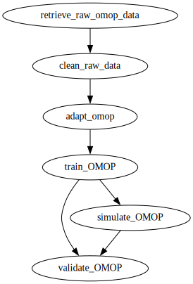

[](https://doi.org/10.5281/zenodo.15482577)

# Main repository for the predOC project

This study developed a machine learning model to predict early risk of high-grade serous ovarian cancer (HGSOC) using electronic health records (EHR) from the Andalusian Health Population Database, which covers over 15 million individuals. Employing an Explainable Boosting Machine (EBM) algorithm, the model was trained on 3,088 HGSOC patients and 114,942 matched controls, achieving a sensitivity of 0.65 and a specificity of 0.85 in identifying high-risk individuals. Key predictors included age, abdominal pain, musculoskeletal and heart conditions, endocrine disorders, and specific blood parameters. The model provided early risk assessment, identifying HGSOC risk before diagnosis for a significant number of cases, with a median lead time of 101 days (Q1: 34 days, Q3: 435.5 days) before diagnosis. This research suggests the model's potential as a cost-effective, scalable pre-screening tool for early HGSOC detection using routine EHR data, potentially leading to earlier interventions and improved patient outcomes. The study was funded by AstraZeneca and grants from the Spanish Ministry of Science and Innovation and Consejeria de Salud y Consumo, Junta de Andalucía.

## Setup
To facilitate switching between machines, an environment variable definition file `.env` will be used. This file will be placed in the root of the repository once it is cloned. There is an example file in the assets.

### Clone the repository

Clone the repository, preferably working via `ssh`.
```
git@github.com:babelomics/predoc.git
cd predoc
```

### Define user-specific environment variables

First, copy the example `.env` file.
```bash
cp ./assets/example.env .env
```

Assign the path where the conda environment will be created to the `ENV_FOLDER` variable. Let's assume the environments should be located in, for example, `~/conda_envs`.

Additionally, assign the path where the data is located to the `DATA_PATH` variable, for example, `~/projects/bps_dumps/predoc`. Therefore, the `.env` file would finally look something like this:

```bash
ENV_FOLDER=~/conda_envs
DATA_PATH=~/projects/bps_dumps/predoc

# -- Variables used in predoc/omop/
# Path to remote data
REMOTE_RAW_OMOP_DATA="/folder_1/.../folder_n/data/"
# User and machine name (IP or according to .ssh/config) to connect to
REMOTE_USER="username"
REMOTE_HOST="hostname"
```

It should be noted that the path `~/conda_envs` must exist and allow writing.

### Installation

We will use GNU `make` to simplify the task of installation, generation of binaries, documentation, etc. Therefore, it will be sufficient to execute the project's `makefile`:

```bash
make
```

The `makefile` uses the provided `environment.yml` file for the installation of the conda environment. The `environment.yml` file is located in the root of the repository. However, we provide a *lock* file to ensure that a CUDA capable machine can reproduce the environment where our model was trained. The lock file is located in the `env_linux64_cuda.txt` file. This file is used to recreate this specific conda environment.

### Pipeline

This repository uses [DVC](https://dvc.org/) to manage a pipeline that will retrieve and clean the data before training the model.

#### Pipeline Overview



#### Stages short description

- **retrieve_raw_omop_data**: Retrieves raw data from a remote location using `rsync`.
  - Requires definition on environment variables:
    - `DATA_PATH`: Local folder to place the retrieve OMOP tables. See [Data](#data).
    - `REMOTE_RAW_OMOP_DATA`: Remote folder where the OMOP tables are located. See [Data](#data).
    - `REMOTE_USER`: Username in the remote machine.
    - `REMOTE_HOST`: Remote machine address.
  - Output:
    - `DATA_PATH`/omop/raw/

- **clean_raw_data**: Remove patients from the data if they have certain conditions.
  - Input:
    - `DATA_PATH`/omop/raw
    - Parameter `ban_codes` in `params.yaml`.
  - Output:
    - `DATA_PATH`/omop/rare/

- **adapt_omop**: Adapts OMOP tables data before training the model.
  - Input:
    - `DATA_PATH`/omop/rare
    - Parameter `target_diagnosis_concept_id` in `params.yaml`.
  - Output:
    - `DATA_PATH`/omop/done/

- **train_OMOP**: Trains ML model.
  - Input:
    - `DATA_PATH`/omop/done
  - Output:
    - `DATA_PATH`/omop/train/

- **simulate_OMOP**: Predicts outcomes.
  - Input:
    - `DATA_PATH`/omop/done
  - Output:
    - `DATA_PATH`/omop/simulate/

- **validate_OMOP**: Generates relevant metrics.
  - Input:
    - `DATA_PATH`/omop/train
    - `DATA_PATH`/omop/simulate
  - Output:
    - `DATA_PATH`/omop/validate/

#### Data

The pipeline expects to find the OMOP tables in .parquet format within the folder defined by the environment variable `REMOTE_RAW_OMOP_DATA`. The contents of this directory will be copied in
a local folder defined by the environment variable `DATA_PATH`. In our implementation, this variable should point to a `data/` folder inside the repository, which is ignored by git.

Please note that depending on the dvc version you use folders monitored by DVC cannot exist
outside the repository.

For the model to work, the required OMOP tables are:

- PERSON
- VISIT_OCCURRENCE
- CONDITION_OCCURRENCE
- MEASUREMENT
- PROVIDER
- CONCEPT

#### Running the Pipeline

```bash
# Run the entire pipeline
dvc repro

# Run a specific stage
dvc repro train_OMOP
```

Please note that the current implementation of the pipeline reproduces all the data used in the paper. This involves numerous training cycles that require time to be processed.

#### Parameters

Parameters are stored in `params.yaml`. Key parameters:

- `ban_codes`: List of `condition_source_concept_id` codes to filter patients out.
  - Any patient that has one of these codes will be removed from the data.
- `target_diagnosis_concept_id`: `condition_source_concept_id` that the model will use as target to train.

Our source data have a local vocabulary that we had to map to the standard OMOP vocabulary:

- 2000000033 is our local OMOP code for ovarian cancer.

## Personnel

### Contributos

Victor Manuel de la Oliva Roque [](https://orcid.org/0000-0002-1444-3465)

Alberto Esteban-Medina [](https://orcid.org/0000-0003-2265-0410)

Laura Alejos [](https://orcid.org/0000-0002-1444-3465)

Isidoro Gutiérrez-Álvarez [](https://orcid.org/0000-0002-9078-3007)

### Scientific Management
Carlos Loucera [](https://orcid.org/0000-0001-9598-6965)

### Management
Joaquin Dopazo [](https://orcid.org/0000-0003-3318-120X)


## Aknowledgements

This project would not have been possible without the continuous support of the [Andalusian Population Health Database (BPS)](https://www.sspa.juntadeandalucia.es/servicioandaluzdesalud/profesionales/sistemas-de-informacion/base-poblacional-de-salud) and their diligent efforts in maintaining the database over the years (specially Dolores Muñoyerro-Muñiz and Román Villegas).

## Funding

This study was funded by AstraZeneca project “Retrospective observational study for the development of early predictors of high grade serous ovarian cancer” (ES-2021-3211) and is also supported by grants PID2020-117979RB-I00 from the Spanish Ministry of Science and Innovation and grant IE19_259 FPS from Consejeria de Salud y Consumo, Junta de Andalucía.
